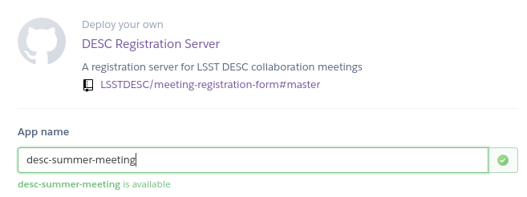
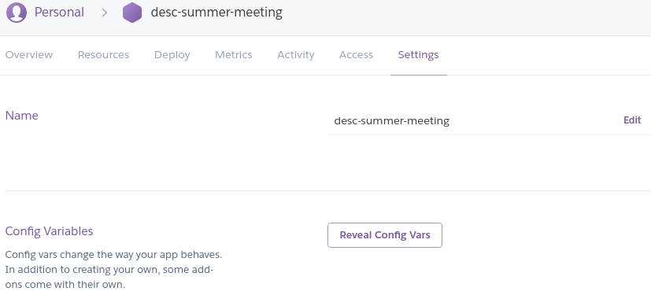
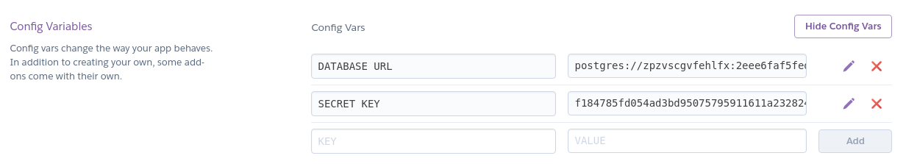

# meeting-registration-form
Meetings committee compliant online registration form for LSST DESC meetings.
Can be **deployed in under 5 minutes** and embedded on Confluence or anywhere else.

Checkout a live preview of the registration form
 [here](https://lsstdesc.github.io/meeting-registration-form/index.html?backend=&secret=).

## Deploy

- Step 1: Click this button:

 [](https://heroku.com/deploy)

- Step 2: Create a free account

- Step 3: Choose a name for your registration server:
 

  In this example, the `SERVER_URL` will be `https://desc-summer-meeting.herokuapp.com`

- Step 4: Click the *Deploy* button and let the magic happen.

- Step 5: Retrieve registration key:
  - Click on *Manage App* then *Settings* and finally click the *Reveal Config Vars* button:
   
  - Copy the value of `SECRET_KEY`:
   

- Step 6: Replace in the following URL the values for `SERVER_URL` and `SECRET_KEY`:
```
https://lsstdesc.github.io/meeting-registration-form/index.html?backend=SERVER_URL&secret=SECRET_KEY
```
and that's it! The registration form at this address will be up and running.

  You can either use this link directly, or embed the form on your meeting webpage using
the following html code (again, replace `SERVER_URL` and `SECRET_KEY`):
```HTML
<iframe src="https://lsstdesc.github.io/meeting-registration-form/index.html?backend=SERVER_URL&secret=SECRET_KEY"  width="1000" height="1000" scrolling="yes" style="border:none" seamless></iframe>
```

- Step 7 (optional): Embed on Confluence page:
   - Click the *Insert* button, go to *Other macros*.
   - Insert and *HTML* macro (not *HTML Include*).
   - Add the above html snippet. Save. Done !
